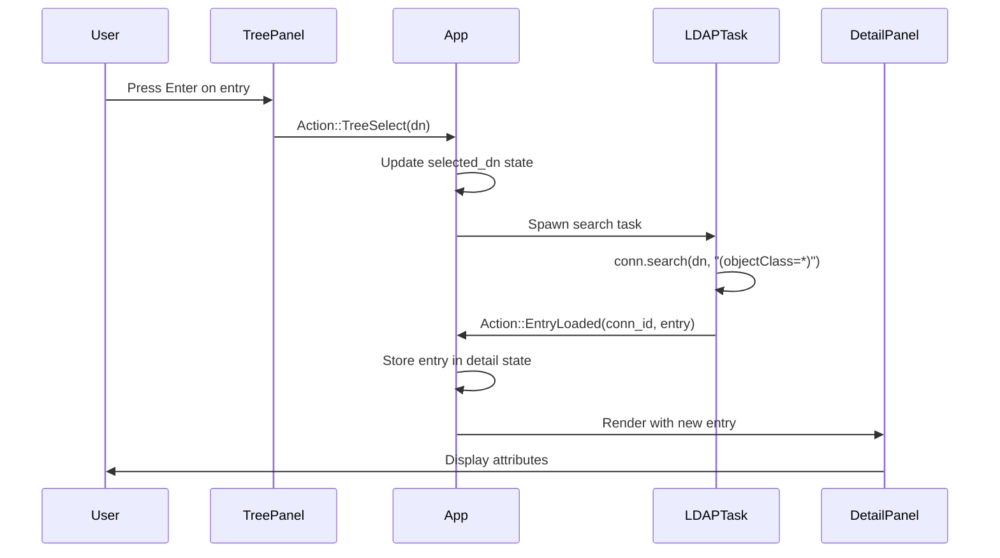

## Workspace Structure

Loom LDAP Browser is organized as a Cargo workspace with three crates, each with distinct responsibilities:

```text
crates/
  loom-ldapbrowser/  Binary crate - CLI parsing and application entry point
  loom-core/         Library - LDAP operations, export/import, schema
  loom-tui/          Library - TUI framework, components, themes
```

### Crate Responsibilities

<AccordionGroup>
  <Accordion title="loom-ldapbrowser (Binary)">
    The main binary crate that ties everything together.

    **Responsibilities:**
    - Command-line argument parsing with `clap`
    - Application initialization and entry point
    - TUI runtime setup
    - Credential prompting (`rpassword`)
    - Configuration file discovery

    **Key Dependencies:**
    - `loom-tui` - TUI application logic
    - `loom-core` - LDAP operations
    - `clap` - CLI argument parsing
    - `tokio` - Async runtime
  </Accordion>

  <Accordion title="loom-core (Library)">
    Core LDAP client functionality and business logic.

    **Modules:**
    - `connection.rs` - LDAP connection management and operations
    - `schema.rs` - Schema parsing and caching (object classes, attribute types)
    - `search.rs` - LDAP search operations with paging support
    - `modify.rs` - Entry modification (add, replace, delete attributes)
    - `entry.rs` - Entry data structures and serialization
    - `dn.rs` - Distinguished Name parsing and manipulation
    - `filter.rs` - LDAP filter parsing and validation
    - `tree.rs` - Directory tree navigation structures
    - `export/` - LDIF, JSON, CSV, XLSX export formats
    - `import/` - LDIF, JSON, CSV, XLSX import parsers
    - `bulk.rs` - Bulk update operations
    - `tls.rs` - TLS configuration and certificate trust
    - `credentials.rs` - Password retrieval (keychain, command, prompt)
    - `auth.rs` - LDAP bind authentication
    - `server_detect.rs` - Server type detection (OpenLDAP, AD, etc.)
    - `offline.rs` - In-memory demo directory for testing
    - `vault.rs` - Encrypted credential storage

    **Key Dependencies:**
    - `ldap3` - LDAP protocol implementation
    - `serde`, `serde_json`, `toml` - Serialization
    - `csv`, `rust_xlsxwriter`, `calamine` - Export/Import
    - `keyring` - OS keychain integration
    - `rustls` - TLS support
  </Accordion>

  <Accordion title="loom-tui (Library)">
    Terminal user interface framework and all UI components.

    **Core Modules:**
    - `app.rs` - Main application state machine (124KB - the heart of the app)
    - `action.rs` - Action enum and dispatch types
    - `config.rs` - Configuration file parsing and profiles
    - `keymap.rs` - Keybinding configuration and handling
    - `theme.rs` - Theme system and color palettes
    - `event.rs` - Terminal event loop
    - `focus.rs` - Focus management across panels
    - `tui.rs` - Terminal initialization and rendering

    **UI Components** (`components/`):
    - `tree_panel.rs` - Directory tree browser
    - `detail_panel.rs` - Entry attribute viewer
    - `command_panel.rs` - Search input and command bar
    - `tab_bar.rs` - Connection tab switcher
    - `status_bar.rs` - Status and hints display
    - `connections_tree.rs` - Profiles tree view
    - `connection_form.rs` - Profile editor form
    - `attribute_editor.rs` - Attribute value editor with DN search
    - `attribute_picker.rs` - Add attribute dialog
    - `search_dialog.rs` - Search results popup
    - `schema_viewer.rs` - Schema browser
    - `export_dialog.rs` - Export configuration form
    - `bulk_update_dialog.rs` - Bulk update form
    - `create_entry_dialog.rs` - New entry wizard
    - `connect_dialog.rs` - Quick connect dialog
    - `help_popup.rs` - Help overlay
    - `context_menu.rs` - Right-click context menus
    - `cert_trust_dialog.rs` - Certificate trust prompt
    - `vault_password_dialog.rs` - Vault password prompt

    **Key Dependencies:**
    - `ratatui` - TUI framework
    - `crossterm` - Terminal backend
    - `tui-tree-widget` - Tree component
    - `tui-textarea` - Text input widget
    - `tui-logger` - Log panel integration
    - `nucleo` - Fuzzy search
  </Accordion>
</AccordionGroup>

---

## Action Dispatch Pattern

All state changes in Loom LDAP Browser flow through an **Action enum** dispatched via an async channel. This architecture keeps the UI responsive by running LDAP operations in background Tokio tasks.

### The Action Enum

The `Action` enum (defined in `loom-tui/src/action.rs`) is the central message type:

```rust
#[derive(Debug, Clone)]
pub enum Action {
    // System events
    Tick,
    Render,
    Quit,
    Resize(u16, u16),

    // Navigation
    FocusNext,
    FocusPrev,
    NextTab,
    PrevTab,

    // Connection lifecycle
    ConnectAdHoc(ConnectionProfile, String),
    Connected(ConnectionId, String, ServerType),
    ConnectionError(String),

    // Tree operations
    TreeExpand(String),
    TreeCollapse(String),
    TreeSelect(String),
    TreeChildrenLoaded(ConnectionId, String, Vec<TreeNode>),

    // Entry operations
    EntryLoaded(ConnectionId, LdapEntry),
    EditAttribute(String, String, String),
    SaveAttribute(EditResult),
    AttributeSaved(String),
    DeleteEntry(String),
    EntryDeleted(String),

    // Search
    SearchExecute(String),
    SearchResults(ConnectionId, Vec<LdapEntry>),

    // And many more...
}
```

### Dispatch Flow

<Steps>
  <Step title="User Input">
    Terminal events (key presses, mouse clicks) are captured by the event loop and converted to actions by UI components.

    ```rust
    // Example: Tree panel handles 'j' key
    KeyCode::Char('j') => vec![Action::TreeDown]
    ```
  </Step>

  <Step title="Action Sent to App">
    Actions are sent through an async channel (`tokio::sync::mpsc`) to the main application state machine.

    ```rust
    action_tx.send(Action::TreeDown).await?;
    ```
  </Step>

  <Step title="State Update">
    The `App::update()` method in `app.rs` receives the action and updates state. For I/O operations, it spawns a background task.

    ```rust
    match action {
        Action::TreeExpand(dn) => {
            // Spawn async LDAP task
            let conn = self.current_connection();
            tokio::spawn(async move {
                let children = conn.search_one_level(&dn).await?;
                action_tx.send(
                    Action::TreeChildrenLoaded(conn_id, dn, children)
                ).await?;
            });
        }
        Action::TreeChildrenLoaded(conn_id, dn, children) => {
            // Update tree state with results
            self.tree.add_children(&dn, children);
        }
        // ...
    }
    ```
  </Step>

  <Step title="UI Re-render">
    After state updates, a `Render` action triggers the UI to redraw with the new state.

    ```rust
    self.terminal.draw(|f| ui::render(f, &self.state))?;
    ```
  </Step>
</Steps>

### Benefits of Action Dispatch

<CardGroup cols={2}>
  <Card title="Non-blocking UI" icon="gauge-high">
    LDAP operations run in background tasks, keeping the UI responsive even during slow network operations.
  </Card>
  <Card title="Testability" icon="flask">
    Actions can be tested in isolation without a running LDAP server by inspecting action sequences.
  </Card>
  <Card title="Debugging" icon="bug">
    All state transitions are explicit actions that can be logged for debugging.
  </Card>
  <Card title="Extensibility" icon="puzzle-piece">
    New features add new action variants without disrupting existing logic.
  </Card>
</CardGroup>

---

## Data Flow Example: Loading Entry Details

Here's how data flows when a user selects an entry in the tree:



<Note>
  The async action pattern is inspired by Redux and Elm architecture, providing predictable state management with immutable state transitions.
</Note>

---

## Component Communication

Components communicate **only through actions**. They don't hold direct references to each other.

```rust
// ❌ BAD: Direct component coupling
impl TreePanel {
    fn select_entry(&mut self, dn: String, detail_panel: &mut DetailPanel) {
        detail_panel.load_entry(&dn);  // Tight coupling!
    }
}

// ✅ GOOD: Action-based communication
impl TreePanel {
    fn select_entry(&mut self, dn: String) -> Vec<Action> {
        vec![Action::TreeSelect(dn)]  // Decoupled!
    }
}
```

This decoupling allows components to be developed, tested, and debugged independently.

---

## Building the Workspace

Use Cargo workspace commands to build all crates:

<CodeGroup>
```bash Check all crates
cargo check --workspace
```

```bash Build release binary
cargo build --workspace --release
```

```bash Test all crates
cargo test --workspace
```

```bash Lint with Clippy
cargo clippy --workspace -- -D warnings
```
</CodeGroup>

<Info>
  The `--workspace` flag ensures all three crates (loom-ldapbrowser, loom-core, loom-tui) are built together with consistent dependencies.
</Info>

---

## Dependency Graph

```text
loom-ldapbrowser (binary)
    ├── loom-tui (library)
    │   └── loom-core (library)
    │       └── ldap3, serde, csv, xlsx, keyring, ...
    └── loom-core (library)
```

- **loom-ldapbrowser** depends on both libraries
- **loom-tui** depends on **loom-core** for LDAP types
- **loom-core** has no internal dependencies (only external crates)

This layered architecture keeps business logic (core) separate from presentation (tui).